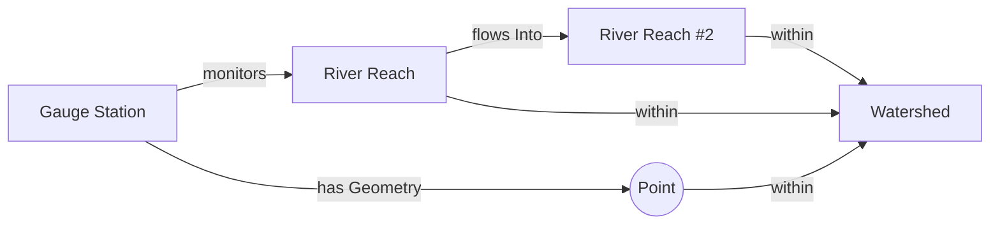
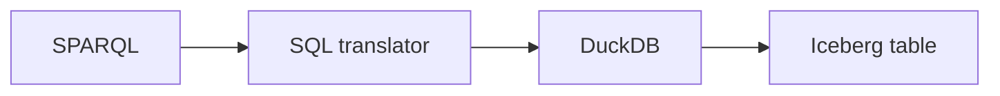

# SAL
<p class="text-2xl font-semibold tracking-wide" style="opacity: 0.6">Semantic Accessibility Layer</p>

### A Build System and Query Engine for Geospatial Knowledge Graphs

<div class="mt-12 text-lg opacity-95">
Colton · Center for Geospatial Solutions (CGS) Lincoln Institute of Land Policy
</div>
<div class="mt-2 opacity-80">
2026 CGA Conference · Harvard Center for Geographic Analysis
</div>


<!--
Open on who I am, then the one-sentence hook: we built a linked-data / SPARQL
graph without running a triple store — it lives as an Iceberg table. That's
the whole talk.
-->

---

# Teams face 3 challenges when sharing geospatial open data

<div class="feature-list solo mt-8">

<div class="feature-row">
<div class="icon-badge"><carbon:money /></div>
<div>
<h3>Budget to host data long term</h3>
<p><strong>SAL:</strong> The graph is just files in S3; can use cheap long-term storage like OCI registries</p>
</div>
</div>

<div class="feature-row">
<div class="icon-badge"><carbon:compare /></div>
<div>
<h3>Semantic definitions for properly integrating data into other research</h3>
<p><strong>SAL:</strong> Every term is linked to a standardized RDF vocabulary</p>
</div>
</div>

<div class="feature-row">
<div class="icon-badge"><carbon:fingerprint-recognition /></div>
<div>
<h3>Tracking provenance, both the data and the source code that produced it</h3>
<p><strong>SAL:</strong> Each build links the data to the exact git commit that produced it.</p>
</div>
</div>

</div>

---

# Geospatial data often models well as a graph

<p class="text-xl -mt-1" style="color: var(--cgs-pavement); opacity: 0.7">Many systems have thousands of properties and spatial relationships connecting places.<br />Joins in a traditional database can become cumbersome.</p>

<div class="mt-10 flex justify-center">



</div>

<!--
Set up the intuition. A gauge monitors a reach, the reach flows into another
reach, sits within a watershed. That's a graph — geometry is just another edge.
-->

---

# Graphs have unique advantages over relational databases for geospatial data

<div class="grid grid-cols-3 gap-6 mt-14">

<div class="card">
<div class="icon-badge"><carbon:connect /></div>
<h3>Deeply nested relationships become visible</h3>
<p>Spatial relationships across multiple tables become easier to query</p>
</div>

<div class="card">
<div class="icon-badge"><carbon:link /></div>
<h3>Links across organizations</h3>
<p>IRIs and Ontologies are key parts of the graph. Common IRIs allow for cross-organization linking</p>
</div>

<div class="card">
<div class="icon-badge"><carbon:location /></div>
<h3>Space is just another edge</h3>
<p>GeoSPARQL answers topology and semantics in one query.</p>
</div>

</div>

<!--
Three points, one per card. The URI point is the one that matters for a CGA
audience: linking across organizations without agreeing on a schema.
-->

---

# So why doesn't everyone use graph databases?

<div class="grid grid-cols-3 gap-6 mt-10">

<div class="card warn">
<span class="num">01</span>
<div class="icon-badge"><carbon:locked /></div>
<h3>Lock-in</h3>
<p>Slight deviations from the spec, custom indices, or engines that weren't entirely open source</p>
</div>

<div class="card warn">
<span class="num">02</span>
<div class="icon-badge"><carbon:chart-line-smooth /></div>
<h3>Tooling that didn't scale</h3>
<p>Single-node RDF stores, slow load times, lack of developer tooling, spatial as an afterthought.</p>
</div>

<div class="card warn">
<span class="num">03</span>
<div class="icon-badge"><carbon:data-base /></div>
<h3>Engine welded to the store</h3>
<p>Many relation engines can be queried via Spark, Trino, or DuckDB at the same time. Graphs couldn't</p>
</div>

</div>

<!--
Don't name every triple store. The pattern is the point: closed format,
doesn't scale, engine and storage are one inseparable product.
The idea — linked, semantic data — was right; the infrastructure wasn't.
-->

---

# One solution to many issues: Apache Iceberg

<div class="feature-list mt-6">

<div class="feature-row">
<div class="icon-badge"><carbon:document /></div>
<h3>Open format</h3>
<p>Parquet plus open metadata, on any file system or bucket.</p>
</div>

<div class="feature-row">
<div class="icon-badge"><carbon:recently-viewed /></div>
<h3>Time travel</h3>
<p>Every build in your table is a snapshot you can query or diff.</p>
</div>

<div class="feature-row">
<div class="icon-badge"><carbon:map /></div>
<h3>Geo support</h3>
<p>A native <code>geometry</code> type in Iceberg v3.</p>
</div>

<div class="feature-row">
<div class="icon-badge"><carbon:api /></div>
<h3>Many engines</h3>
<p>DuckDB, Spark, Trino, PyIceberg all read the same table.</p>
</div>

<div class="feature-row">
<div class="icon-badge"><carbon:cloud-upload /></div>
<h3>Easy deployment</h3>
<p>Files in a bucket. No server to stand up.</p>
</div>

</div>

<!--
Each of these answers one of the three problems: open format vs lock-in,
many engines vs the welded engine, files in a bucket vs standing up a server.
Time travel and native geometry are bonuses the old stores never had.
-->

---
hideLogo: true
---

# The gist of our graph schema: one row per triple

<div class="panel mt-6">

| subject | predicate | object |
|---|---|---|
| `gauge:0101` | `hyf:monitors` | `reach:42` |
| `gauge:0101` | `geo:hasGeometry` | `POINT(-89.5 40.5)` |
| `reach:42` | `hyf:flowsInto` | `reach:43` |
| `reach:42` | `geo:within` | `huc:0712` |

</div>

<div class="feature-list mt-5">

<div class="feature-row">
<div class="icon-badge"><carbon:data-table /></div>
<h3>Subject, predicate, object</h3>
<p>Any graph fits in one table. Objects get typed columns, so geometry stays geometry.</p>
</div>

<div class="feature-row">
<div class="icon-badge"><carbon:data-enrichment /></div>
<h3>Dictionary encoding</h3>
<p>IRIs and predicates repeat constantly. Parquet stores each once and uses small integer codes per row.</p>
</div>

</div>

<!--
Keep this high level. Every edge in the graph is a row: subject, predicate, object.
The repetition that looks wasteful is exactly what Parquet's dictionary encoding
compresses away — the same few predicates across millions of rows cost almost nothing,
and filters on them are fast.
-->

---

# How the graph gets built

<div class="flow mt-5">

<div class="flow-node">
<div class="icon-badge"><carbon:logo-git /></div>
<h3>RDF in Git</h3>
<p>The source of truth</p>
</div>

<div class="flow-arrow">
<code>sal build</code>
<div class="line"></div>
<span>validated against pinned vocabularies</span>
</div>

<div class="flow-node">
<div class="icon-badge"><carbon:data-table /></div>
<h3>Iceberg table</h3>
<p>Each build produces a snapshot in the table, linking to the git commit.</p>
</div>

<div class="flow-arrow">
<code>sal upload</code>
<div class="line"></div>
<span>publish</span>
</div>

<div class="flow-node">
<div class="icon-badge"><carbon:cloud-upload /></div>
<h3>Published</h3>
<p>To a bucket or an OCI registry</p>
</div>

<div class="flow-rollback">
<div class="vline"></div>
<span>don't like it? roll back</span>
</div>

<div class="flow-node inline muted">
<div class="icon-badge"><carbon:recently-viewed /></div>
<div>
<h3>Previous snapshot</h3>
<p>Iceberg efficiently marks changes at scale.</p>
</div>
</div>

</div>

<div class="callout mt-5">
<strong>The key point:</strong> the data and the source that built it are linked together. Vital for long-term reproducibility.
</div>

<!--
Source of truth is Git. sal build validates, writes the table, and records
which exact version of every ontology it checked against.
If a build looks wrong, roll the table back to a previous snapshot.
-->

---

# Querying: SPARQL compiled to SQL

<div class="mt-12 flex justify-center">



</div>

<div class="grid grid-cols-2 gap-6 mt-14">

<div class="card compact">
<div class="icon-badge"><carbon:data-base /></div>
<h3>No triplestore to load or maintain</h3>
<p>The graph stays an Iceberg table hosted on S3. Queries run against it in place.</p>
</div>

<div class="card compact">
<div class="icon-badge"><carbon:chip /></div>
<h3>DuckDB is linked into <code>sal</code></h3>
<p>Nothing to install or run alongside it. Utilize a standard engine. </p>
</div>

</div>

<!--
The key design choice: we never load the graph into a store. SPARQL becomes
SQL and DuckDB runs it directly against the Iceberg table.
-->

---

# Example: features in a bounding box

<div class="grid grid-cols-2 gap-6 mt-6 code-sm">
<div>

<span class="code-label">SPARQL</span>

```sparql
SELECT ?feature
WHERE {
  ?feature geo:hasGeometry ?geometry .
  ?geometry geo:asWKT ?wkt .
  FILTER(geof:sfIntersects(?wkt,
    "POLYGON((-91 39,-88 39,-88 42,-91 42,-91 39))"
      ^^geo:wktLiteral))
}
```

</div>
<div>

<span class="code-label sql">SQL</span>

```sql
SELECT t0.subject AS "feature"
FROM triples AS t0
CROSS JOIN triples AS t1
WHERE t0.predicate = '...geosparql#hasGeometry'
  AND t1.predicate = '...geosparql#asWKT'
  AND t0.object_iri = t1.subject
  AND ST_Intersects(t1.object_geometry,
    ST_GeomFromText('POLYGON((-91 39, ...))'))
```

</div>
</div>

<div class="feature-list mt-6 ml-40">

<div class="feature-row">
<div class="icon-badge"><carbon:table /></div>
<h3>Triple pattern</h3>
<p>One alias of the triples table</p>
</div>

<div class="feature-row">
<div class="icon-badge"><carbon:connect /></div>
<h3>Shared variable</h3>
<p><code>?geometry</code> becomes the join condition</p>
</div>

<div class="feature-row">
<div class="icon-badge"><carbon:map /></div>
<h3>GeoSPARQL filter</h3>
<p><code>geof:sfIntersects</code> becomes DuckDB's <code>ST_Intersects</code></p>
</div>

</div>

<!--
This is SAL's own GeoSPARQL test case (prefixes and IRIs shortened for the slide).
Each triple pattern is one alias of the table; the shared ?geometry variable is the
join; the spatial FILTER maps mechanically onto DuckDB's spatial extension, running
on the native object_geometry column.
-->

---

# What we're keeping

<div class="grid grid-cols-3 gap-6 mt-12">

<div class="card">
<span class="num">1</span>
<div class="icon-badge"><carbon:cube /></div>
<h3>A graph is a table</h3>
<p>It needs an open table format and a fast embedded engine — not a graph database.</p>
</div>

<div class="card">
<span class="num">2</span>
<div class="icon-badge"><carbon:branch /></div>
<h3>Git + Iceberg</h3>
<p>Versioned, diffable, provenance-tracked graphs.</p>
</div>

<div class="card">
<span class="num">3</span>
<div class="icon-badge"><carbon:share /></div>
<h3>Publish once</h3>
<p>Query from anywhere: DuckDB, Spark, PyIceberg, or SPARQL.</p>
</div>

</div>

<!--
Three takeaways. If the audience remembers one: the graph is just a table.
-->

---
